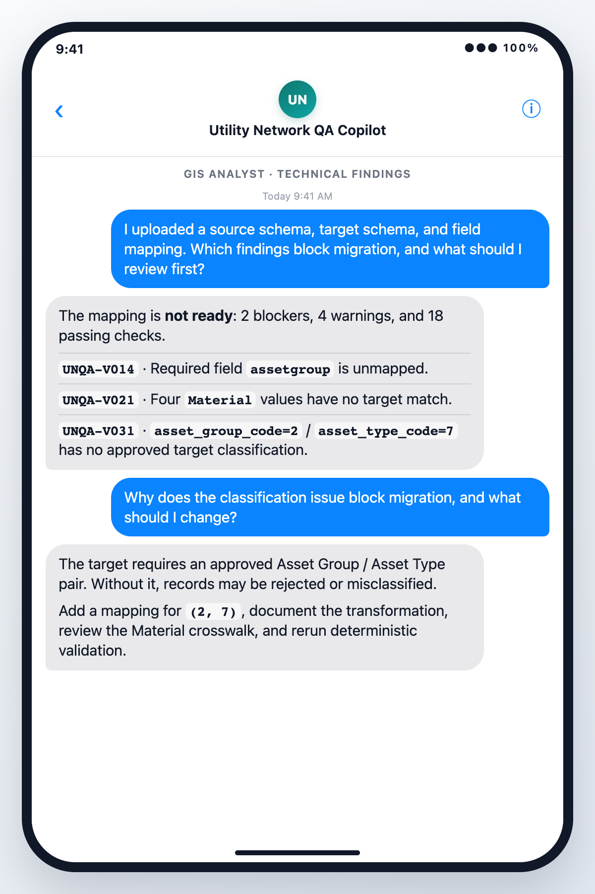
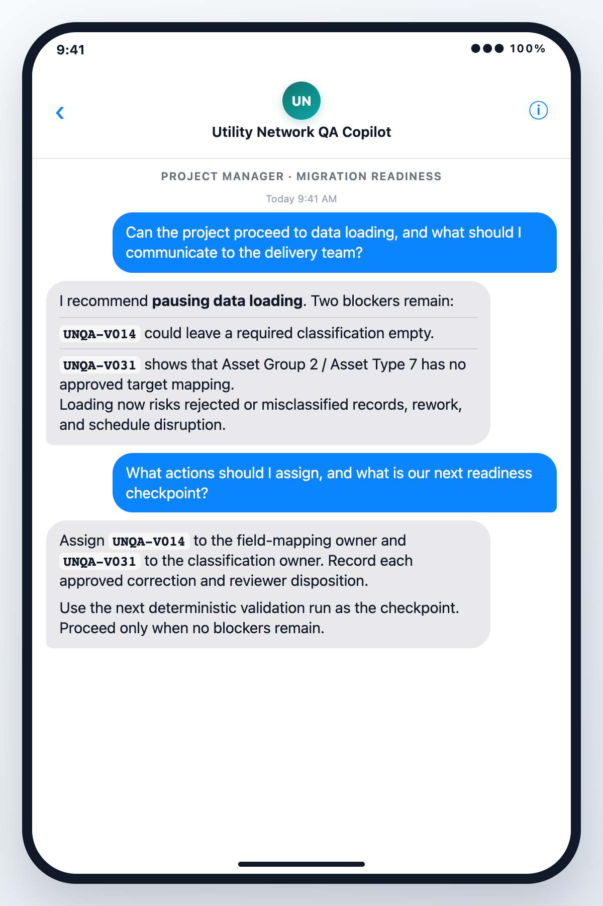
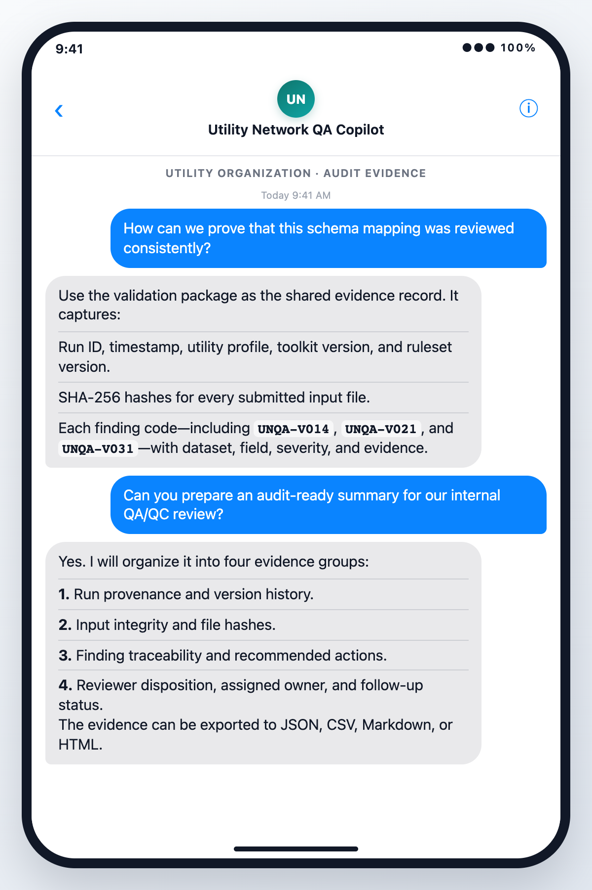

# Utility Network Schema QA Copilot

An open-source, AI-assisted validation toolkit for water, wastewater, and stormwater Utility Network schema mappings.

The Utility Network Schema QA Copilot helps utilities, engineering firms, municipalities, and GIS teams identify schema and mapping problems before data migration begins. It combines a deterministic Python validation engine with an AI knowledge assistant that explains findings, cites technical guidance, and recommends remediation steps.

The validation engine remains the source of truth. AI improves understanding and documentation—it does not replace engineering judgment or alter validation results.

## Why This Project Exists

Utility Network migrations often require teams to review hundreds of fields, coded-value domains, asset classifications, mapping decisions, and loading requirements across multiple workbooks and systems.

Manual review can result in:

- Missing or duplicated field mappings.
- Incompatible source and target data types.
- Unmapped required fields.
- Invalid domain and subtype values.
- Incorrect asset group and asset type assignments.
- Inconsistent rules across project teams.
- Migration issues discovered only after data loading.
- QA/QC decisions that are difficult to document or reproduce.

This toolkit moves schema QA earlier in the migration lifecycle and produces consistent, reviewable validation records.

## Key Capabilities

### Deterministic Schema Validation

- Compare source and target schema definitions.
- Identify missing, duplicated, and unmapped fields.
- Validate required and nullable target fields.
- Detect incompatible data types and field lengths.
- Review default values and transformation requirements.
- Assign pass, warning, or fail severity to each finding.

### Mapping Validation

- Validate source-to-target field mappings.
- Detect one-to-many and many-to-one mapping conflicts.
- Identify incomplete transformation definitions.
- Flag mappings that may result in null or truncated values.
- Review ignored source fields and unmapped target fields.
- Preserve reviewer notes and disposition history.

### Domain and Asset Classification QA

- Validate coded-value domain mappings.
- Identify source values missing from target domains.
- Review subtype compatibility.
- Validate asset group and asset type assignments.
- Detect invalid or ambiguous classifications.
- Compare domain coverage across datasets.

### Water, Wastewater, and Stormwater Profiles

The toolkit includes configurable validation profiles for:

- Water distribution networks.
- Wastewater collection networks.
- Stormwater and drainage networks.

Each profile defines domain-specific terminology, expected asset categories, validation rules, severity levels, and recommended review actions. Organizations can extend these profiles without modifying the validation engine.

### AI-Assisted Explanations

The Copilot can:

- Explain validation findings in plain language.
- Summarize the most important migration blockers.
- Recommend review and remediation steps.
- Answer questions about schema and mapping reports.
- Compare alternative mapping decisions.
- Generate executive and technical summaries.
- Retrieve relevant guidance with source citations.

AI explanations remain separate from deterministic validation findings.

### Evidence-Grade Reporting

Every validation run records:

- Toolkit and ruleset version.
- Selected utility profile.
- Input file hashes.
- Validation configuration.
- Execution timestamp.
- Complete findings and severity levels.
- Referenced guidance.
- Model and provider information, when AI is enabled.

Reports can be exported as:

- HTML
- Markdown
- JSON
- CSV

## How It Helps Organizations

| Organizational need | How the Copilot helps |
| --- | --- |
| Reduce migration risk | Identifies schema and mapping problems before loading begins. |
| Standardize QA/QC | Applies the same documented rules across projects and reviewers. |
| Improve auditability | Records what was checked, which rules were applied, and why issues were flagged. |
| Preserve institutional knowledge | Converts specialist review practices into reusable profiles and guidance. |
| Accelerate onboarding | Helps new analysts understand findings and recommended actions. |
| Support project governance | Produces executive summaries and detailed technical reports from the same validation run. |
| Improve collaboration | Gives GIS, engineering, data, and project-management teams a shared findings format. |
| Support automation | Provides machine-readable JSON and CSV outputs for pipelines and dashboards. |
| Reduce software barriers | Performs schema preflight review without requiring ArcGIS Pro or ArcPy. |
| Scale across utility domains | Uses one validation engine with water, wastewater, and stormwater profiles. |

## Intended Users

- Municipal water and sewer utilities.
- Stormwater and drainage programs.
- Utility Network implementation teams.
- GIS analysts and developers.
- Civil and environmental engineering firms.
- Data migration and ETL teams.
- QA/QC managers.
- Infrastructure consultants.
- Students and researchers studying utility modernization.

## Supported Inputs

The toolkit accepts schema and mapping information in:

- CSV
- Microsoft Excel
- JSON
- YAML

Common inputs include:

- Source schema inventory.
- Target schema inventory.
- Source-to-target mapping table.
- Domain crosswalk.
- Asset group and asset type crosswalk.
- Validation configuration.
- Utility-domain profile.

## Quick Start

### Installation

~~~bash
pip install utility-network-schema-qa
~~~

### Run a Complete Validation

~~~bash
un-schema-qa validate \
  --profile water \
  --source examples/water/source_schema.csv \
  --target examples/water/target_schema.csv \
  --mapping examples/water/field_mapping.xlsx \
  --domains examples/water/domain_mapping.csv \
  --output reports/water_schema_qa.html
~~~

### Generate Machine-Readable Results

~~~bash
un-schema-qa validate \
  --profile wastewater \
  --source examples/wastewater/source_schema.csv \
  --target examples/wastewater/target_schema.csv \
  --mapping examples/wastewater/field_mapping.xlsx \
  --format json \
  --output reports/wastewater_schema_qa.json
~~~

### Ask the Copilot to Explain Findings

~~~bash
un-schema-qa explain \
  --report reports/water_schema_qa.json \
  --provider openai
~~~

The deterministic validator does not require an AI provider. AI functionality uses a bring-your-own-key configuration and supports cloud and local model adapters.

## Example Conversations

These examples show how different stakeholders can have a natural conversation with the AI agent about deterministic validation results. Each example includes an iOS-style visual preview and an expandable text transcript for accessibility and search.

### GIS Analyst — Investigate Technical Findings

  

<strong>Read the accessible conversation transcript</strong>

> [!NOTE]
> 👤 **User**
>
> “I uploaded a source schema, target schema, and field mapping. Which findings block migration, and what should I review first?”

> [!TIP]
> 🤖 **Utility Network Schema QA Copilot**
>
> I completed the deterministic review. The mapping is **not ready for migration**: I found **2 blockers**, **4 warnings**, and **18 passing checks**.
>
> The highest-priority findings are:
>
> - `UNQA-V014` — The required target field `assetgroup` has no source mapping.
> - `UNQA-V021` — Four source values in the `Material` domain have no approved target match.
> - `UNQA-V031` — The combination `asset_group_code=2` and `asset_type_code=7` has no approved target classification.
>
> The affected datasets include `ServiceLine` and `Device`. Resolve the required-field and classification mappings first, then review the `Material` crosswalk with the data owner.

> [!NOTE]
> 👤 **User**
>
> “Why does the classification issue block migration, and what should I change?”

> [!TIP]
> 🤖 **Utility Network Schema QA Copilot**
>
> The target requires an approved Asset Group / Asset Type pair. Without one, migrated records may be rejected or assigned to the wrong network classification.
>
> Add an approved mapping for `(2, 7)`, document the transformation, review the `Material` crosswalk, and rerun deterministic validation. The blocker remains open until the rules confirm that the target classification is valid.

---

### Project Manager — Understand Migration Readiness

  

<strong>Read the accessible conversation transcript</strong>

> [!NOTE]
> 👤 **User**
>
> “Can the project proceed to data loading, and what should I communicate to the delivery team?”

> [!TIP]
> 🤖 **Utility Network Schema QA Copilot**
>
> I recommend **pausing data loading**. Two blocker findings remain unresolved:
>
> - `UNQA-V014` could leave a required target classification empty.
> - `UNQA-V031` shows that Asset Group `2` / Asset Type `7` has no approved target mapping.
>
> The schema review is substantially complete, but the project has not met the migration-readiness gate. Loading now risks rejected or misclassified records, rework, and schedule disruption.

> [!NOTE]
> 👤 **User**
>
> “What actions should I assign, and what is our next readiness checkpoint?”

> [!TIP]
> 🤖 **Utility Network Schema QA Copilot**
>
> Assign `UNQA-V014` to the field-mapping owner and `UNQA-V031` to the classification owner. Each owner should record the approved correction and reviewer disposition.
>
> Use the next deterministic validation run as the checkpoint. Proceed only when no blockers remain and the team has reviewed any remaining warnings.

---

### Utility Organization — Create Audit-Ready Evidence

  

<strong>Read the accessible conversation transcript</strong>

> [!NOTE]
> 👤 **User**
>
> “How can we prove that this schema mapping was reviewed consistently?”

> [!TIP]
> 🤖 **Utility Network Schema QA Copilot**
>
> Use the validation package as the shared evidence record. It captures:
>
> - Run ID, timestamp, selected utility profile, toolkit version, and ruleset version.
> - SHA-256 hashes for every submitted input file.
> - Each finding code—including `UNQA-V014`, `UNQA-V021`, and `UNQA-V031`—with its dataset, field, severity, and supporting evidence.
>
> This gives GIS, engineering, management, and governance teams the same reproducible review baseline.

> [!NOTE]
> 👤 **User**
>
> “Can you prepare an audit-ready summary for our internal QA/QC review?”

> [!TIP]
> 🤖 **Utility Network Schema QA Copilot**
>
> Yes. I would organize the summary around four evidence groups:
>
> 1. **Run provenance** — run ID, execution timestamp, toolkit version, profile, and ruleset version.
> 2. **Input integrity** — SHA-256 hashes for every submitted file.
> 3. **Finding traceability** — rule code, affected dataset and field, severity, evidence, and recommended action.
> 4. **Review accountability** — reviewer disposition, notes, assigned owner, and follow-up status.
>
> The same evidence can be exported to JSON, CSV, Markdown, or HTML for technical review, governance records, and project assurance.

> [!IMPORTANT]
> Deterministic findings remain the source of truth. AI-generated explanations and recommendations cannot alter finding codes, severity, evidence, or validation status.

## Python API

~~~python
from un_schema_qa import ValidationProject

project = ValidationProject.from_files(
    profile="stormwater",
    source_schema="source_schema.csv",
    target_schema="target_schema.csv",
    mapping="field_mapping.xlsx",
    domains="domain_mapping.csv",
)

result = project.validate()

print(result.summary)
result.export_html("stormwater_schema_qa.html")
result.export_json("stormwater_schema_qa.json")
~~~

## Web Application

The public web application provides a guided workflow:

1. Select water, wastewater, or stormwater.
2. Upload source and target schema files.
3. Upload field and domain mappings.
4. Run deterministic validation.
5. Review findings by dataset, rule, and severity.
6. Ask the Copilot to explain selected findings.
7. Export the complete QA/QC report.

Uploaded information is processed for the current validation session and is not used to train language models.

## MCP and Agent Integration

The toolkit includes an MCP server that exposes the validation engine to compatible AI applications.

Available tools include:

- **inspect_schema**
- **compare_schemas**
- **validate_mapping**
- **validate_required_fields**
- **validate_domains**
- **validate_asset_classifications**
- **summarize_findings**
- **generate_qa_report**
- **search_utility_guidance**
- **explain_finding**

Example MCP configuration:

~~~json
{
  "mcpServers": {
    "utility-network-schema-qa": {
      "command": "un-schema-qa-mcp",
      "args": ["serve"]
    }
  }
}
~~~

## Agent Skill

The repository includes an installable agent skill that teaches compatible coding agents how to:

- Select the correct utility profile.
- Inspect schema and mapping inputs.
- Run the appropriate validation tools.
- Interpret structured findings.
- Distinguish deterministic results from AI recommendations.
- Generate a traceable QA/QC report.
- Avoid modifying source data without explicit authorization.

## Knowledge and Guidance Layer

The retrieval layer contains curated public guidance and project documentation covering:

- Utility Network schema readiness.
- Source-to-target mapping review.
- Domain and subtype validation.
- Asset group and asset type classification.
- Data migration QA/QC.
- Error classification.
- Water, wastewater, and stormwater data modeling.
- Validation report interpretation.

Every retrieved explanation includes its source. Retrieved content cannot change deterministic findings.

## Architecture

~~~text
CLI / Web / Python / MCP / Agent Skill
                  |
                  v
          Agent Orchestrator
             /          \
            v            v
Validation Engine    Knowledge Retrieval
       |                    |
       v                    v
Domain Profiles      Referenced Guidance
             \          /
              v        v
          Report Generator
~~~

## Safety and Governance

- Validation is read-only.
- The toolkit does not connect to production databases by default.
- The toolkit does not perform data migration or reconcile/post operations.
- AI cannot change validation results.
- All findings include the responsible validation rule.
- Model access is optional and configurable.
- Local-model operation is supported.
- Sensitive values can be excluded from AI requests.
- Reports record the ruleset and software version used.

## Testing

The project includes:

- Unit tests for every validation rule.
- Water, wastewater, and stormwater test profiles.
- Golden-file tests for reports.
- Invalid and edge-case mapping fixtures.
- CLI integration tests.
- MCP tool contract tests.
- AI structured-output tests.
- Retrieval citation tests.
- Cross-provider compatibility tests.

## Project Structure

~~~text
Utility-Network-Schema-QA-Copilot/
├── src/un_schema_qa/
│   ├── engine/
│   ├── validators/
│   ├── profiles/
│   ├── knowledge/
│   ├── agent/
│   ├── reporting/
│   ├── cli/
│   └── mcp/
├── app/
├── skills/
├── examples/
│   ├── water/
│   ├── wastewater/
│   └── stormwater/
├── tests/
├── docs/
├── pyproject.toml
├── LICENSE
└── README.md
~~~

## Contributing

Contributions are welcome from utility professionals, GIS analysts, engineers, developers, researchers, and public-sector organizations.

Useful contributions include:

- Additional validation rules.
- Domain-profile improvements.
- Example mapping scenarios.
- Documentation corrections.
- New report formats.
- Accessibility improvements.
- Model-provider integrations.
- Reproducible bug reports.

## License

Released under the Apache License 2.0.

## Disclaimer

This toolkit supports schema review and migration QA/QC. It does not replace Utility Network architecture review, organizational change control, regulatory analysis, or professional engineering judgment. Final migration and production decisions remain with authorized project personnel.
